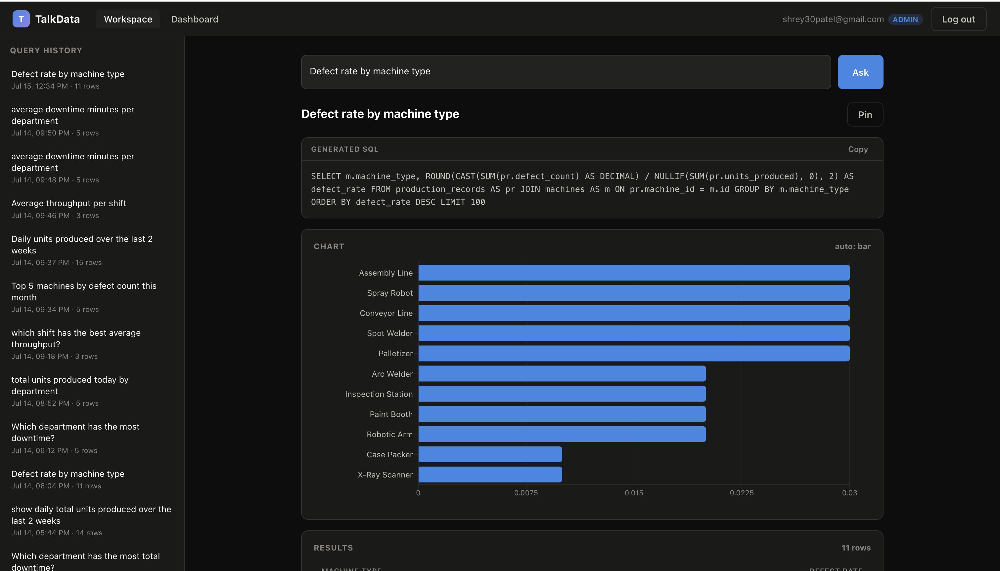
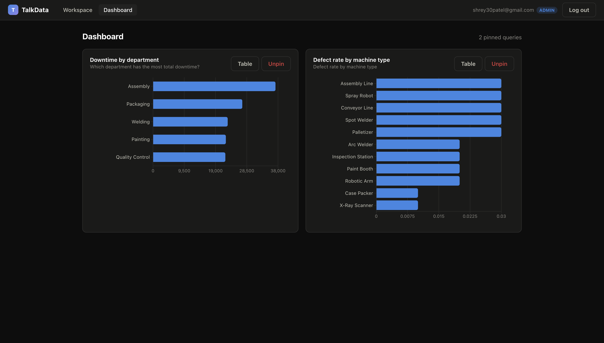

# TalkData

TalkData is an AI-powered analytics platform that lets anyone query a database in plain English — no SQL required. Type a business question like *"which department has the most downtime?"* and get back the generated SQL (shown transparently), a results table, and an automatically chosen chart. It's built for operations teams and analysts who know their questions but not their schemas.

## Live

- **App:** https://talkdata-sigma.vercel.app
- **API docs (Swagger):** https://talkdata-api.onrender.com/docs

> Free-tier hosting note: the first request after ~15 minutes of inactivity takes up to a minute while the backend cold-starts.

## Key Features

- **Natural language → SQL** — questions become PostgreSQL via Groq (Llama 3.3 70B), with a one-shot automatic repair loop that feeds execution errors back to the model
- **Schema-aware RAG** — table/column metadata (with synonyms and join hints) is embedded in pgvector; each question retrieves only the relevant schema context, so the model can't hallucinate against tables it shouldn't see
- **Transparent SQL** — every generated query is displayed to the user before the results, never hidden
- **Auto-selected charts** — bar / line / pie / stat tile chosen from the shape and semantics of the result (averages never get pie charts)
- **Defense-in-depth SQL security** — AST-level validation, table whitelisting, CTE scope tracking, read-only execution with timeouts, per-user rate limiting (details below)
- **JWT auth with RBAC** — access/refresh token pair, admin vs member roles enforced server-side per request
- **Query history & pinned dashboards** — every question is saved and re-runnable; favorites pin to a live mini-dashboard
- **Airflow ETL pipeline** — daily ingest → clean → prune → hard data-quality gates over a realistic manufacturing dataset
- **55-test pytest suite** — the SQL guard, chart heuristics, auth, and rate limiter are all under test

## Screenshots

<!-- Add screenshots to docs/screenshots/ with these exact names: -->




## Tech Stack

| Layer | Technology |
|---|---|
| Frontend | React 19 (Vite), recharts, react-router, axios |
| Backend | FastAPI (Python 3.11), SQLAlchemy 2.0 async, Pydantic v2 |
| Database + vector store | Supabase — Postgres with pgvector |
| LLM | Groq API (Llama 3.3 70B) for NL→SQL; fastembed (all-MiniLM-L6-v2, ONNX) for embeddings |
| Data pipeline | Apache Airflow 2.10 (local ETL), APScheduler (in production) |
| Auth | JWT (access + refresh) with role-based access control |
| Deployment | Render (backend, Docker), Vercel (frontend), GitHub auto-deploy |
| Testing | pytest — 55 tests |

## Architecture

```
React (Vercel)
   │  JWT-authenticated REST
   ▼
FastAPI (Render)
   │ 1. embed the question, retrieve relevant schema docs   ──►  pgvector
   │ 2. build prompt with retrieved context, generate SQL   ──►  Groq
   │ 3. validate SQL (AST whitelist), one repair retry
   │ 4. execute read-only with statement timeout            ──►  Supabase Postgres
   │ 5. pick chart type from result shape
   ▼
SQL + rows + chart type → rendered in the browser; question saved to history
```

The RAG step is what makes generation reliable: instead of stuffing the whole schema into every prompt, each table and column is described in natural language (including synonyms like "outage" for downtime), embedded once, and retrieved by cosine similarity per question. App tables (users, history) are deliberately never embedded — the model doesn't know they exist.

**Scheduling split:** locally, real Airflow DAGs own the dataset refresh (`airflow/docker-compose.airflow.yml` — a 5-task ETL with quality gates, plus a weekly embedding refresh). In production, the same jobs run via APScheduler inside the FastAPI process, because Airflow's multi-process footprint doesn't fit Render's free tier. Same schedules, same data contract, one source of truth for the schema metadata (the DAG bind-mounts the backend's module).

## Security Highlights

LLM-generated SQL is treated as untrusted input, with three independent layers between the model and the database:

1. **AST validation (sqlglot)** — the query is parsed, never regex-matched. Exactly one statement, `SELECT`-only, no schema-qualified names, no system functions (`pg_read_file`, `pg_sleep`, …), a hard row cap, and a **table whitelist with real CTE scope tracking**: a CTE alias is only visible to later CTEs and the main body, so `WITH users AS (SELECT * FROM users) SELECT * FROM users` is correctly rejected — inside its own definition, `users` still refers to the real table.
2. **Read-only execution** — validated SQL runs on a dedicated connection inside a `READ ONLY` transaction with a 10-second statement timeout. Even a query that slipped past validation cannot write or hang the service.
3. **Knowledge isolation via RAG** — sensitive tables are absent from the embedded schema docs, so the model never sees them in context and can't target them by name.

Plus per-user rate limiting on the query endpoint (sliding window, `429` + `Retry-After`) and bcrypt password hashing with short-lived access tokens.

The 55-test suite covers every attack category above — and writing it caught a **real whitelist bypass** (the CTE-shadowing case) plus an unhandled parser crash before they ever shipped. The full story is in the project log.

## Run It Locally

Prereqs: Docker Desktop, Node 18+, a free [Supabase](https://supabase.com) project (with `create extension vector`) and a [Groq](https://console.groq.com) API key.

```bash
git clone https://github.com/Shrey3008/Talkdata.git
cd Talkdata

# 1. Backend — configure and start
cp backend/.env.example backend/.env      # fill in DATABASE_URL, JWT_SECRET_KEY, GROQ_API_KEY
docker compose up -d --build
docker compose exec backend alembic upgrade head   # create tables
docker compose exec backend python seed.py         # load sample dataset
docker compose exec backend python embed_schema.py # embed schema docs for RAG

# 2. Frontend
cd frontend
echo "VITE_API_URL=http://localhost:8000" > .env.local
npm install
npm run dev                                # → http://localhost:5173

# 3. (Optional) Airflow ETL demo
cd ../airflow
docker compose -f docker-compose.airflow.yml up    # UI → http://localhost:8081 (admin/admin)

# Tests
docker compose exec backend python -m pytest tests/
```

---

Want the full build history — every phase, technical decision, and bug (including the ones the tests caught)? See **[PROJECT_LOG.md](PROJECT_LOG.md)**.
